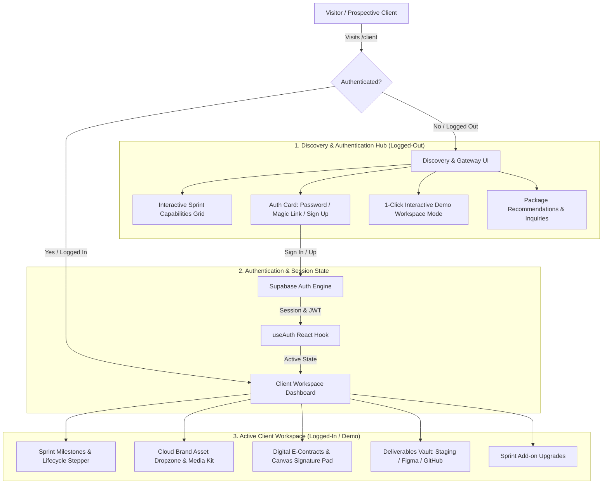
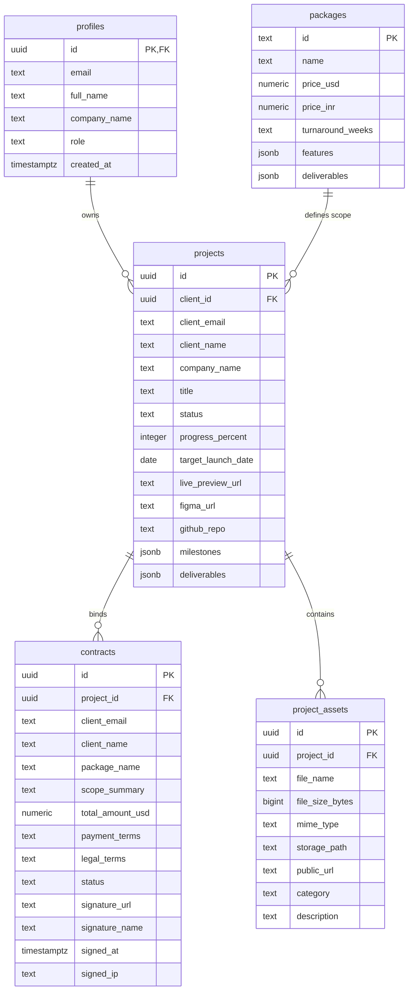

# 📑 Client Management & Authentication Architecture Documentation

This document specifies the technical architecture, authentication workflows, database schema management, Row Level Security (RLS) policies, and UI state segmentation implemented in **Tanie Lalwani's Client Management Workspace**.

---

## 1. System Overview & Architecture

The Client Management platform provides private client workspaces with clear segmentation between **unauthenticated visitors/prospective clients** and **authenticated active project clients**.



---

## 2. Authentication Architecture & Client Segregation

The project uses Supabase Auth configured with real-time session subscriptions, custom fetch handlers for modern opaque API keys, and server-side JWT verification.

### 2.1 Supabase Client Proxy (`src/lib/supabaseClient.ts`)
- **Opaque Publishable Key Support**:
  - Handles modern Supabase publishable keys (`sb_publishable_...`) through a custom fetch handler (`createSupabaseFetch`) to prevent HTTP header collisions.
- **Lazy Proxy Pattern**:
  - `export const supabase = new Proxy(...)` prevents client instantiation issues during SSR/SSG.
- **Graceful Fallback**:
  - Automatically activates fallback mock sessions if Supabase environment variables are missing during initial development or offline testing.

### 2.2 Dedicated React Auth Hook (`src/hooks/useAuth.ts`)
- **Reactive State Management**:
  - Subscribes in real-time to `supabase.auth.onAuthStateChange` and `supabase.auth.getSession()`.
  - Exposes `{ user, session, loading, error, signInWithPassword, signUp, signInWithOtp, signOut, isAuthenticated }`.
- **Token Auto-Refresh & Persistence**:
  - Tokens are persisted safely in browser `localStorage` with background token refreshing.

### 2.3 Server-Side Auth Verification Guard (`src/lib/auth-helper.ts`)
- **JWT Inspection**:
  - Extracts the HTTP `Authorization: Bearer <token>` header.
  - Verifies the user directly via `supabase.auth.getUser(token)`.
  - Returns `{ supabase, userId, user }` or `{ error, status: 401 }`.

---

## 3. User Interface State Segmentation

| UI State | Target Audience | Key Features & Actions |
| :--- | :--- | :--- |
| **Logged-Out (Visitor / Prospect)** | Prospective clients, leads, new visitors | - **Feature Capabilities Grid**: Explains Sprint Milestones, Cloud Dropzone, E-Contracts, and Deliverables Vault.<br/>- **Interactive Auth Form**: Segmented tabs for **Password Login**, **Instant Magic Link**, and **Create Account**.<br/>- **1-Click Demo Client Workspace**: Lets prospects immediately test the dashboard without signing up.<br/>- **Inquiry Actions**: Links to `/packages` and `/contact`. |
| **Logged-In (Active Client)** | Authenticated clients with active projects | - **Client Header**: Shows Client Name, Company Name, Active Project Title, Target Launch Date, and one-click Sign Out.<br/>- **Tab 1: Milestones**: 6-stage lifecycle stepper (Discovery -> Design -> Development -> Review -> Launch -> Completed) + Progress bar.<br/>- **Tab 2: Brand Assets**: Cloud dropzone supporting SVG, PNG, PDF, 3D GLB/GLTF with category tagging (`brand_assets`, `logo`, `content_copy`, `images_media`).<br/>- **Tab 3: E-Contracts**: Contract scope terms, milestone fee schedules, and interactive canvas `SignaturePad` with IP & timestamp recording.<br/>- **Tab 4: Upgrades**: Package add-on inquiries for new sprints. |
| **Landing Page (`/`)** | General Public | Remains public, fast, and unaltered. |

---

## 4. Database Schema & Tables

Schemas are managed in PostgreSQL via Supabase:



---

## 5. Row Level Security (RLS) Standard

RLS is enabled on every public table. All policies use subqueries `(SELECT auth.uid())` and `(SELECT auth.jwt() ->> 'email')` to ensure $O(1)$ query performance and prevent privilege escalation:

### 5.1 Project Access Policy
```sql
ALTER TABLE public.projects ENABLE ROW LEVEL SECURITY;

-- Clients can only view/manage projects where client_email matches their JWT or client_id = auth.uid()
CREATE POLICY "Clients can view own projects" 
  ON public.projects FOR SELECT TO authenticated 
  USING (
    (SELECT auth.uid()) = client_id OR 
    (SELECT auth.jwt() ->> 'email') = client_email
  );

-- Admins & Service Role have full access
CREATE POLICY "Admin manage projects" 
  ON public.projects FOR ALL TO authenticated, service_role 
  USING (
    auth.role() = 'service_role' OR 
    (SELECT auth.jwt() ->> 'email') IN ('tanielalwani.work@gmail.com', 'admin@tanie.me')
  );
```

### 5.2 Asset & Storage Policy
```sql
ALTER TABLE public.project_assets ENABLE ROW LEVEL SECURITY;

CREATE POLICY "Clients can manage their project assets" 
  ON public.project_assets FOR ALL TO authenticated 
  USING (
    EXISTS (
      SELECT 1 FROM public.projects p 
      WHERE p.id = project_assets.project_id 
      AND (p.client_id = (SELECT auth.uid()) OR p.client_email = (SELECT auth.jwt() ->> 'email'))
    )
  );
```

### 5.3 E-Contract Signing Policy
```sql
ALTER TABLE public.contracts ENABLE ROW LEVEL SECURITY;

CREATE POLICY "Clients can view and sign their contracts" 
  ON public.contracts FOR ALL TO authenticated 
  USING (
    (SELECT auth.jwt() ->> 'email') = client_email OR
    (SELECT auth.uid()) = client_id
  );
```

---

## 6. File Reference Index

| File | Purpose |
| :--- | :--- |
| [`src/hooks/useAuth.ts`](file:///c:/Users/words/Desktop/Websites/Completed/Portfolio/src/hooks/useAuth.ts) | React hook subscribing to Supabase session state changes. |
| [`src/lib/supabaseClient.ts`](file:///c:/Users/words/Desktop/Websites/Completed/Portfolio/src/lib/supabaseClient.ts) | Supabase client proxy with opaque key fetch handling and offline safety. |
| [`src/lib/auth-helper.ts`](file:///c:/Users/words/Desktop/Websites/Completed/Portfolio/src/lib/auth-helper.ts) | Server-side bearer token authentication helper. |
| [`src/lib/portalServices.ts`](file:///c:/Users/words/Desktop/Websites/Completed/Portfolio/src/lib/portalServices.ts) | Data services for projects, contracts, assets, packages, and mock fallbacks. |
| [`src/views/ClientPortal.tsx`](file:///c:/Users/words/Desktop/Websites/Completed/Portfolio/src/views/ClientPortal.tsx) | Main client management view with dynamic Logged-Out vs Logged-In rendering. |
| [`src/components/SignaturePad.tsx`](file:///c:/Users/words/Desktop/Websites/Completed/Portfolio/src/components/SignaturePad.tsx) | HTML5 Canvas cryptographic signature pad supporting drawing and typing. |
| [`src/components/Navbar.tsx`](file:///c:/Users/words/Desktop/Websites/Completed/Portfolio/src/components/Navbar.tsx) | Navigation bar with real-time active client workspace status indicator. |
| [`supabase_schema.sql`](file:///c:/Users/words/Desktop/Websites/Completed/Portfolio/supabase_schema.sql) | Full PostgreSQL database migrations and RLS policies. |
